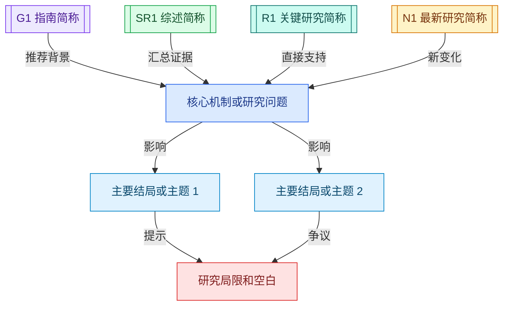
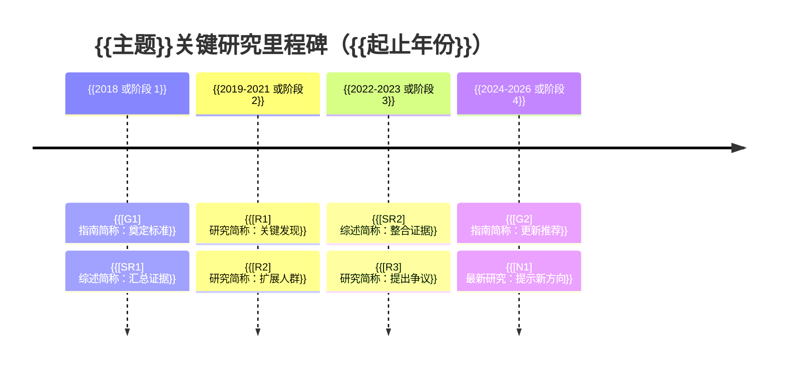

# {{主题}}医学文献循证检索分析报告

<!-- 生成约束：本模板用于用户明确要求 Word/docx 时的内容骨架；通过 lark-doc 的 office-word 模块生成真正 docx。不要把本注释写入正文。 -->

| 文档信息 | 内容 |
|---|---|
| 报告类型 | 医学文献循证检索分析 |
| 任务类型 | {{主题综述/指南查新/热点分析/课题论证/论文写作/学习资料}} |
| 检索截止日期 | {{日期}} |

> 使用边界：本报告为 AI 辅助生成的医学文献循证检索与分析材料，用于学习、科研、论文写作和临床证据讨论参考，不替代医生诊疗决策、伦理审查、正式系统综述、统计分析或人工专家审稿。

## 一、结论

**总结：** {{围绕用户提出的问题直接给出当前证据支持的回答、证据确定性和适用边界。首次引用文献名带链接并标注来源/期刊、年份和级别。}}

- **检索结论：** {{概括本次检索得到的核心证据格局，例如指南/共识是否一致、系统综述和关键研究是否支持、最新进展带来何种补充或争议；可引用 [G1]、[SR1]、[R1] 或可点击文献名。}}
- **实践启示：** {{说明这些证据对临床实践、学习、课题设计、论文写作或后续查新的意义；关键启示可加粗突出。}}
- **研究局限和空白：** {{说明证据不确定性、仅摘要证据、原文不可及、指南冲突、外推限制、尚缺人群/结局/方法学证据或后续研究机会。}}

## 二、检索问题与范围

| 维度 | 本次设定 |
|---|---|
| 任务类型 | {{主题综述/指南查新/热点分析/课题论证/论文写作/学习资料}} |
| 问题框架 | {{PICO/PECO/PCC/论文论点/学习目标}} |
| 主题或人群 | {{疾病、症状、科室、药物、干预、研究对象}} |
| 结局或关注点 | {{疗效、安全性、诊断性能、指南推荐、热点、研究空白等}} |
| 时间/语言/地域 | {{检索范围}} |
| 纳入/排除 | {{文献类型与排除标准}} |
| 检索来源/数据库 | {{PubMed/PMC、Cochrane、指南官网、学会官网、监管机构、期刊官网、ClinicalTrials.gov、CNKI/万方/中文期刊官网等对用户可见来源；不要写内部工具名称}} |
| 核心关键词 | {{3-8 个核心中英文关键词、缩写或 MeSH/Emtree 近似词；不要铺开全部检索式}} |
| 检索效率 | {{本次采用 {{n_batches}} 个高价值检索批次；Fetch/原文阅读仅覆盖核心证据所需的摘要、推荐条文、主要结果、关键表格和局限；停止继续扩展的理由}} |
| 证据覆盖与局限 | {{覆盖的证据类型、时间范围、语言/地域；未能访问或证据不足的部分}} |

## 三、证据脉络与研究关系

<!-- 生成约束：图表渲染为图片、原生形状或清晰表格；若保留 Mermaid 代码，紧跟图例表。本节默认包含论文关系/核心逻辑梳理图和关键研究里程碑时间线图两张主图；关系图可用多样十六进制颜色。逐篇解读放在第五、六章。不要把本注释写入正文。 -->

### 3.1 论文关系/核心逻辑梳理图

| 图中节点 | 文献/证据 | 链接 | 来源/期刊 | 年份 | 关系/作用 | 阅读状态 |
|---|---|---|---|---|---|---|
| {{[R1] 研究简称}} | {{标题}} | [原文/入口]({{url}}) | {{来源}} | {{年份}} | {{直接支持/限制/提出争议/提示空白}} | {{全文/指南正文/摘要}} |

### 3.2 关键研究里程碑时间线图

| 年份/阶段 | 图中节点 | 里程碑文献/事件 | 意义 | 链接 |
|---|---|---|---|---|
| {{时间段或年份}} | {{[R1] 研究简称}} | {{指南更新/经典研究/重要综述/监管事件}} | {{奠定标准/改变指南/扩展人群/提出争议/最新进展}} | [原文/入口]({{url}}) |

## 四、指南与专家共识

<!-- 生成约束：本章像综述章节一样逐条解读指南/共识，不默认使用矩阵表；每个小节标题中的指南/共识名必须可点击。不要把本注释写入正文。 -->

### {{[G1] [中国或本土指南/专家共识题名]({{url}})}}

**来源与定位：** {{发布机构/期刊，年份；阅读状态与来源级别；说明是否为中国指南、本土共识或专科规范。}}

**与本主题相关的推荐：** {{用段落解释核心推荐、推荐强度/证据等级、适用人群和关键限制。}}

**与其他证据的关系：** {{说明它与后文系统综述、关键研究或国际指南是否一致，是否存在更新点、差异或争议。}}

### {{[G2] [国际指南/共识题名]({{url}})}}

**来源与定位：** {{机构/期刊，年份；阅读状态与来源级别。}}

**核心推荐与边界：** {{解释该指南对用户问题的回答、适用范围、推荐依据和限制。}}

**可借鉴之处：** {{说明对中国实践、科研论证、论文写作或学习框架的启示。}}

## 五、系统综述与关键研究

<!-- 生成约束：本章按“每篇核心文献一个小节”解读，不默认使用大表；小节标题中的研究简称或题名必须可点击。不要把本注释写入正文。 -->

### {{[SR1] [系统综述或 Meta 分析题名]({{url}})}}

**类型与来源：** {{系统综述/Meta；来源/期刊，年份；阅读状态与来源级别。}}

**主要结论：** {{用 2-4 句话解释该文献回答了什么问题、总体发现是什么、对本报告核心结论的支撑或限制是什么。}}

**适用边界与局限：** {{说明人群、干预/暴露、结局、研究质量、异质性、仅摘要或全文可及性等限制。}}

**引用用途：** {{说明适合放在背景、关键证据、争议讨论、研究空白或论文段落中的哪一类位置。}}

### {{[R1] [关键原始研究题名或研究简称]({{url}})}}

**研究设计与对象：** {{RCT/队列/诊断研究/真实世界/机制研究；人群、样本、干预/暴露或比较。}}

**主要结论：** {{解读主要结局、核心发现、与系统综述/指南是否一致。}}

**局限与引用用途：** {{说明偏倚、外推性、样本量、随访、终点或仅摘要限制，以及本报告中如何使用。}}

## 六、最新进展、热点、争议与空白

<!-- 生成约束：本章优先用段落解读最新进展、热点、争议和空白；只有用户明确要求时才补充热点表/争议表。不要把本注释写入正文。 -->

### {{6.1 最新进展：[N1] [最新研究题名或简称]({{url}})}}

**主要变化：** {{说明这篇最新研究、指南更新、新技术或监管信息带来了什么新认识。}}

**与既往证据的关系：** {{说明它是强化、修正、挑战还是补充前述指南/综述/关键研究。}}

**仍需谨慎之处：** {{说明样本、人群、终点、随访、研究设计、真实世界可及性或仅摘要限制。}}

### {{6.2 热点或争议：[N2/R2] [代表文献题名或简称]({{url}})}}

**当前判断：** {{用审慎措辞说明热点方向或争议焦点，不使用高程度或绝对化措辞。}}

**研究空白：** {{说明还缺哪些人群、终点、方法、随访、真实世界或本土证据。}}

## 七、学习、课题或论文写作建议

<!-- 生成约束：本章按用户用途自由组织，优先使用无序列表分点呈现；可用加粗、提示性底色或字体颜色突出关键学习路径、课题机会、引用风险和下一步。引用具体文献时，题名或简称必须可点击。不要把本注释写入正文。 -->

### 7.1 学习或汇报启示

- **学习框架：** {{将前文证据转化为学习框架、汇报主线或临床讨论要点。}}
- **优先阅读：** {{指出推荐优先阅读的指南、系统综述或关键研究，例如 [文献名]({{url}})。}}
- **需要特别标出：** {{可用加粗或提示底色强调关键争议、证据不足或容易误读之处。}}

### 7.2 课题设计启示

- **可行问题：** {{围绕研究空白提出可行研究问题。}}
- **设计要点：** {{说明目标人群、结局指标、对照方案、数据来源或方法学风险。}}
- **证据缺口：** {{标出目前仍缺哪些本土、人群、长期结局或真实世界证据。}}

### 7.3 论文写作和引用建议

- **背景和指南依据：** {{说明哪些文献适合用于背景、指南依据或研究必要性。}}
- **关键证据和争议讨论：** {{说明哪些文献适合用于关键证据、对比讨论或争议段落。}}
- **引用风险：** {{提示仅摘要/待核验资料、外推限制和不可夸大的结论。}}

## 八、完整参考文献

<!-- 生成约束：文末参考文献固定为“标题｜来源｜类型｜年份｜链接”五列表格，每条正式参考文献都要有可点击入口。不要把本注释写入正文。 -->

### 核心证据

| 标题 | 来源 | 类型 | 年份 | 链接 |
|---|---|---|---|---|
| {{标题或研究名}} | {{来源/期刊或机构}} | {{指南/系统综述/RCT/队列等；可附阅读状态}} | {{年份}} | [原文/摘要]({{url}}) |

### 辅助参考

| 标题 | 来源 | 类型 | 年份 | 链接 |
|---|---|---|---|---|
| {{题名}} | {{来源/期刊或机构}} | {{仅摘要/背景资料/辅助参考}} | {{年份}} | [原文/摘要]({{url}}) |
